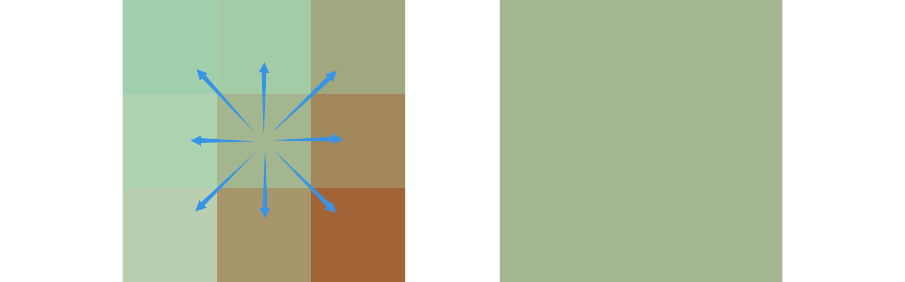
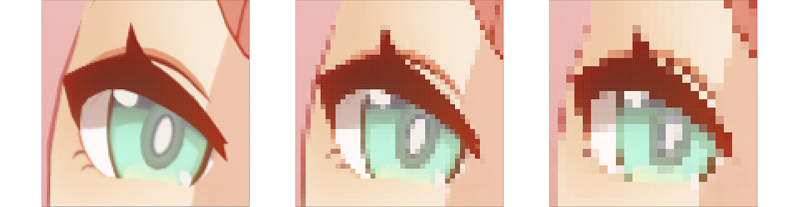

# Pixelation

## About

An example of pixelation that is both fun and practical. This example completes:

1. Pixelation of a single texture.
2. Pixelation filter based on post-processing.
3. Overlay multiple pixelation filters.

The 3 scene files target different shader effects. Adjust the `Pixel Size` value in the material options to view different degrees of pixelation. I make each sprite have a white texture as the default appearance, and then colored by the `BackgroundShader.gdshader` shader (or an UNIQUE one). `PixelizeCanvasItemShader.gdshader` is used for the rendering of a single sprite's material that you want to pixelate, while `PixelizeCanvasLayerShader.gdshader` is a post-processing layer based on the Godot's screen-reading mechanism.

One more thing that pixelation is not a COMPLETE replacement for the pixel art, where every pixel of every image is adjusted by pixel artist for overall visuals and resolution. The pixels in the pixelation shading are determined by the sampling results with uncertainty, which may cause visual information loss. So developers need to decide on their own whether to use pixelation or pixel painting.

## Shaders

During the sampling process, the pixelation shader divides the texture into pixel blocks with pixel size `n`. The color of each pixel block is determined by the sampling result of its center pixel of the square area, thus creating an interesting mosaic effect visually.

> Taking `3x3` pixel-size sampling as an example, the color of the center point pixel is mapped to all pixels in the square area.

> Comparison of the same texture with different pixel-size sampling granularities of [1x1](../Docs/assets/pixelation/sample_pixel_size_1.png), [3x3](../Docs/assets/pixelation/sample_pixel_size_3.png) and [5x5](../Docs/assets/pixelation/sample_pixel_size_5.png).

## Tips

### 1. Sampling drift

The [pixelize.gdshader](https://github.com/godotengine/godot-demo-projects/blob/master/2d/screen_space_shaders/shaders/pixelize.gdshader) in Godot's official demo repository samples the source texture directly after taking the remainder calculation. This method maps the pixel color in the upper left corner of each pixel block to the entire area. When the pixel particles gradually become larger, the overall visual feeling of the image shifting to the lower right corner is called Sampling Drifting.

### 2. Lossless rendering

When the granularity of the pixelation shader equals to 1, the rendering result of the texture should be exactly the same as the original image quality. The accuracy of the results can be confirmed by calculating a hash value of the screenshot or performing a per-pixel-checking comparison in Photoshop.

> Be careful about the automatic mipmaps that may be generated when Godot imports resources. Otherwise, the image sampling quality would be degraded unexpectedly. If it happens, delete the `.import` file and re-import the texture will be helpful.

### 3. Texture filtering options

See details in [TextureFilter](https://docs.godotengine.org/en/stable/classes/class_canvasitem.html#enum-canvasitem-texturefilter). In general, `LINEAR_MIPMAP` acts best visually.

### 4. Layered support

Ideally, the pixelation effect should be individually applied to different rendering canvas layers to adjust the pixel size parameter that are most visually appropriate. Have not supported in this project.

## References

- [Pixelization](https://lettier.github.io/3d-game-shaders-for-beginners/pixelization.html)
- [Custom post-processing](https://docs.godotengine.org/en/stable/tutorials/shaders/custom_postprocessing.html)
- [pixelize.gdshader](https://github.com/godotengine/godot-demo-projects/blob/master/2d/screen_space_shaders/shaders/pixelize.gdshader)

