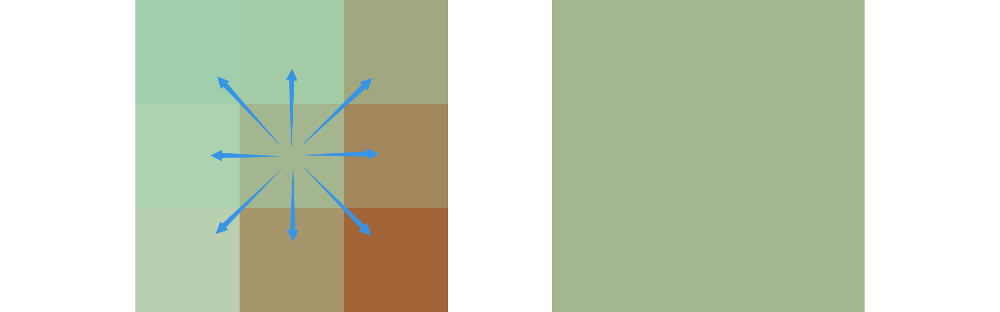
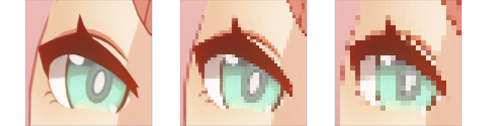

# Pixelize

## About

An example of pixelation that is both fun and practical. This example completes:

1. Pixelation of a single texture.
2. Pixelizing filter based on post-processing.
3. Overlay multiple pixelizing filters.

## Shaders

During the sampling process, the pixelization shader divides the texture into pixel blocks with pixel size `n`. The color of each pixel block is determined by the sampling result of its center pixel, thus creating an interesting mosaic effect visually.

> Taking `3x3` pixel-size sampling as an example, the color of the center point pixel is mapped to all pixels in the area.

> Comparison of the same texture with different pixel-size sampling granularities of [1x1](../Docs/assets/pixelize/sample_pixel_size_1.png), [3x3](../Docs/assets/pixelize/sample_pixel_size_3.png) and [5x5](../Docs/assets/pixelize/sample_pixel_size_5.png).

## Tips

### 1. Sampling drift

The [pixelize.gdshader](https://github.com/godotengine/godot-demo-projects/blob/master/2d/screen_space_shaders/shaders/pixelize.gdshader) in Godot's official demo repository samples the source texture directly after taking the remainder calculation. This method maps the pixel color in the upper left corner of each pixel block to the entire area. When the pixel particles gradually become larger, the overall visual feeling of the image shifting to the lower right corner is called Sampling Drifting.

### 2. Lossless rendering

When the granularity of the pixelization shader equals to 1, the rendering result of the texture should be exactly the same as the original image quality. The accuracy of the results can be confirmed by calculating a hash value of the screenshot or performing a per-pixel-checking comparison in Photoshop.

### 3. Texture filtering options

See details in [TextureFilter](https://docs.godotengine.org/en/stable/classes/class_canvasitem.html#enum-canvasitem-texturefilter). In general, `LINEAR_MIPMAP` acts best visually.

### 4. Layered support

Ideally, the pixelation effect should be individually applied to different rendering canvas layers to adjust the pixel grains that are most visually appropriate. Have not supported in this project.

## References

- [Pixelization](https://lettier.github.io/3d-game-shaders-for-beginners/pixelization.html)
- [Custom post-processing](https://docs.godotengine.org/en/stable/tutorials/shaders/custom_postprocessing.html)
- [pixelize.gdshader](https://github.com/godotengine/godot-demo-projects/blob/master/2d/screen_space_shaders/shaders/pixelize.gdshader)

